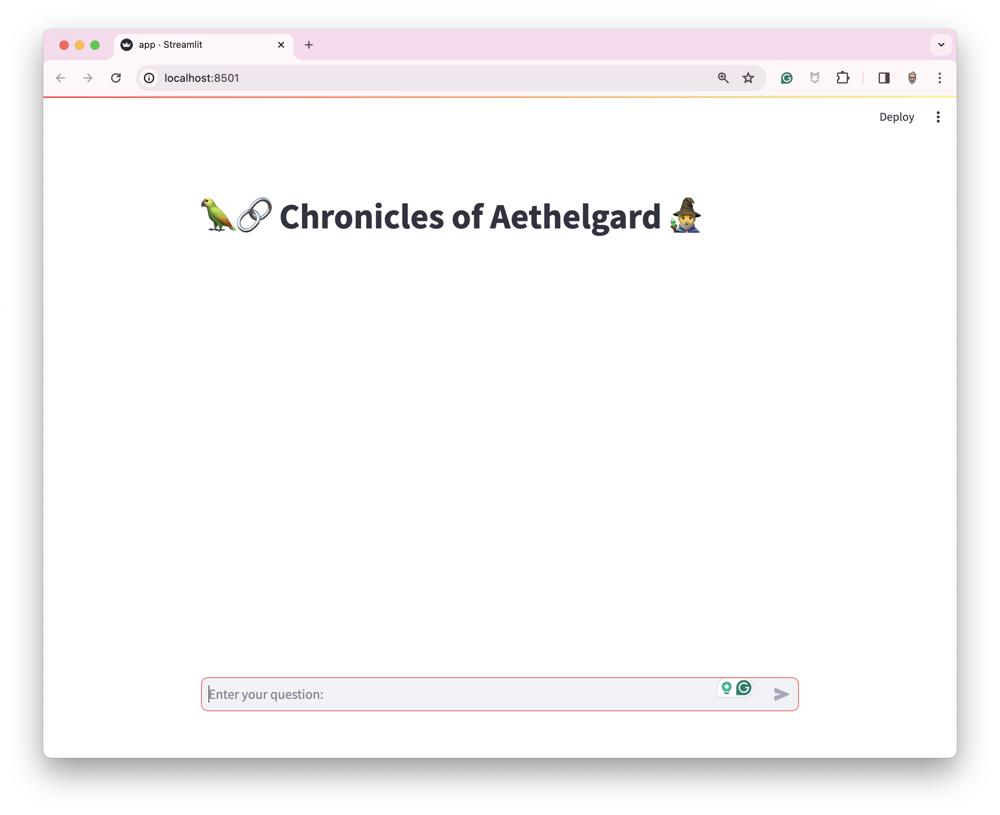
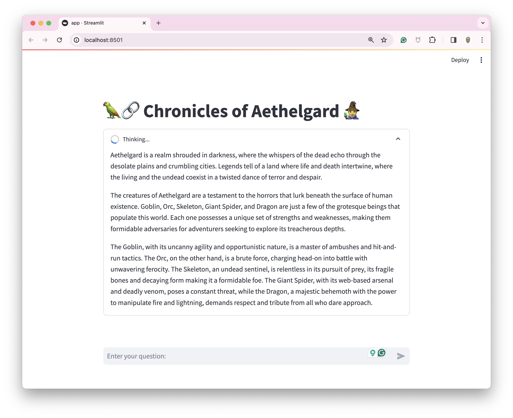
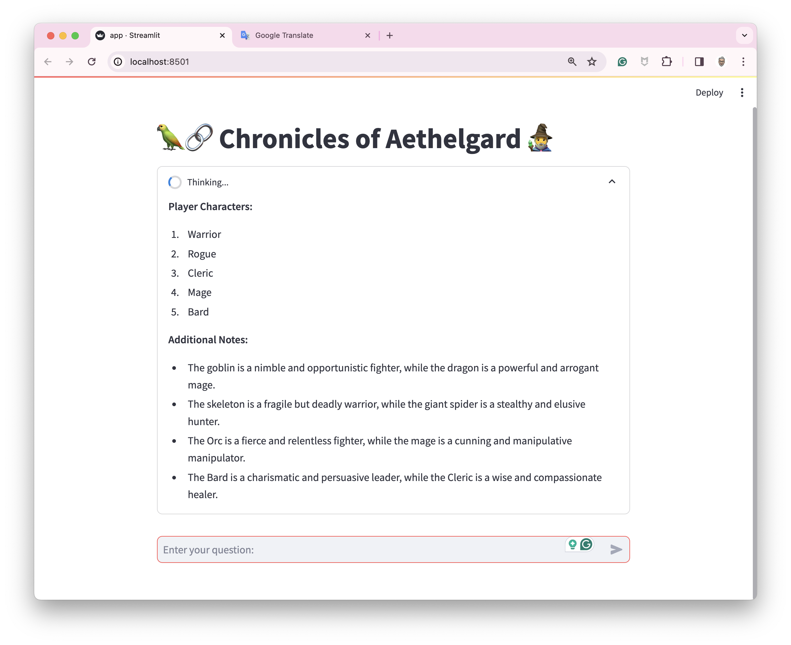
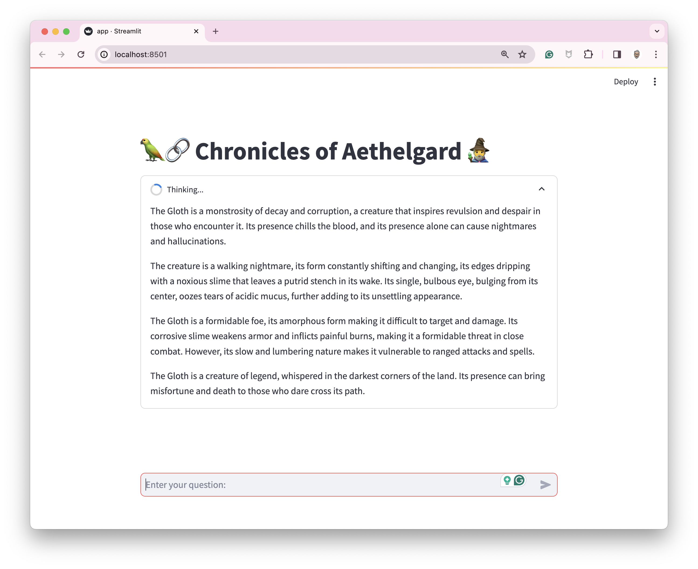

# Chronicles of Aethelgard

This demo is about RAG. The model is augmented with the content of `rules.md`.

`rules.md` describes the rules of a simple RPG (the rules have been generated wit the help of [Gemini](https://gemini.google.com/app))

## How to use this demo

First, start the Docker Compose stack with the following command

> If you run Ollama on MacOS (with GPU):
```bash
docker compose --env-file .mac.env --file compose.mac.yaml watch
```

> If you run Ollama into a container (without GPU):
```bash
docker compose watch
```

> The first launch could take a moment (because of the first download of the LLM)

Once the project started, open [http://localhost:8501/](http://localhost:8501/)



Try this prompt: `What is Aethelgard?`



Try this prompt: `Give me the list of the player characters`



Add the content of `rpg-rules/snippets/gloth.md` to the rules (`rpg-rules/app/rules.md`).
Then, save the modifications. The container is rebuilt automatically.

Try this prompt: `Tell me about the Gloth`


